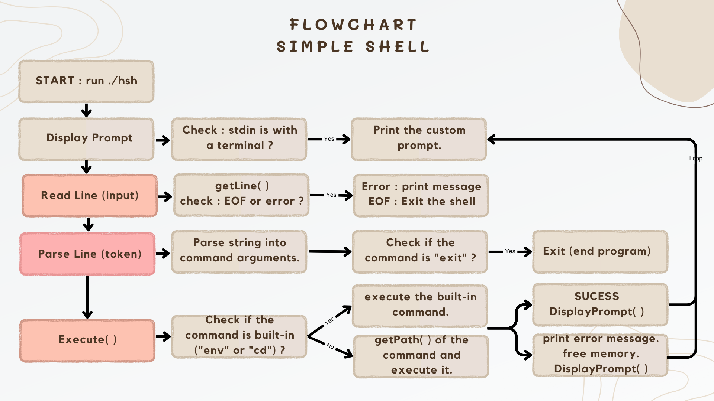
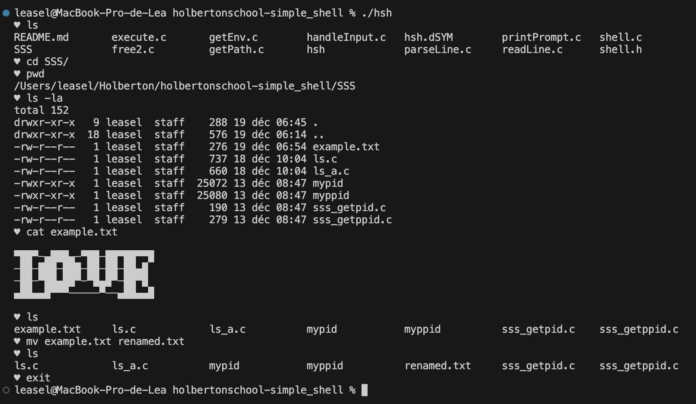

# 𝒮𝒾𝓂𝓅𝓁𝑒 𝒮𝒽𝑒𝓁𝓁

## Table of Contents
- [Description](#description)
- [Run Locally](#run-locally)
- [Example of use](#example-of-use)
- [Commands](#commands)
- [Authors](#authors)

## Description

This is a simple shell program implemented in C. It provides basic functionality such as executing commands and navigating directories.

### Flowchart


### Features

- Executes commands
- Navigates directories
- Handles input and output
- Built-in commands: `cd`, `env` and `exit`
- Custom prompt

### Screenshots


## Run Locally
### Prerequisites
To install and run this program, ensure you have the following:

- Operating System: Ubuntu 20.04 LTS
- Compiler: gcc
- Compiler Options: -Wall -Werror -Wextra -pedantic -std=gnu89

### Installation
Use the following command to install the custom Shell program:

```bash
# Clone the repository
git clone https://github.com/L344S/holbertonschool-simple_shell

# Navigate to the project directory
cd holbertonschool-simple_shell

# Compile the files
gcc -Wall -Werror -Wextra -pedantic *.c -o hsh

# Run the shell (interactive mode):
./hsh
```

### Man page
```sh
$ commande à créer
```

## Example of use
### Interactive mode
```sh
leasel@MacBook-Pro-de-Lea holbertonschool-simple_shell % ./hsh
♥ ls
README.md       execute.c       getEnv.c        handleInput.c   parseLine.c     readLine.c      shell.h
SSS             free2.c         getPath.c       hsh             printPrompt.c   shell.c
♥ pwd
/Users/leasel/Holberton/holbertonschool-simple_shell
♥ exit
leasel@MacBook-Pro-de-Lea holbertonschool-simple_shell %
```
### Non-interactive mode
```sh
leasel@MacBook-Pro-de-Lea holbertonschool-simple_shell % echo "/bin/ls" | ./hsh
README.md       execute.c       getEnv.c        handleInput.c   parseLine.c     readLine.c      shell.h
SSS             free2.c         getPath.c       hsh             printPrompt.c   shell.c
leasel@MacBook-Pro-de-Lea holbertonschool-simple_shell % 
```

## Commands

### Native

| Commande           | Description                          |
|--------------------|----------------------------------------------------------------|
| ls               | List files and directories in the current directory.           |                                           |
| pwd              | Print the current working directory.                          |
| cp               | Copy files or directories.                                    |
| mv               | Move or rename files or directories.                          |
| rm               | Remove files or directories.                                  |
| mkdir            | Create a new directory.                                       |
| rmdir            | Remove an empty directory.                                    |
| cat              | Concatenate and display the content of files.                 |
| more or less  | Display the contents of a file one screen at a time.         |                     |
| touch            | Create an empty file or update the access and modification times of a file. |


### Built-in
| Command  | Description |
| -------- |:------------|
| env      | Displays the current environment |
| cd     | Change directory.   |
| exit     | Causes the shell to terminate |


## Authors
- [@Yazgahar](https://www.github.com/Yazgahar)
- [@L344S](https://www.github.com/L344S)